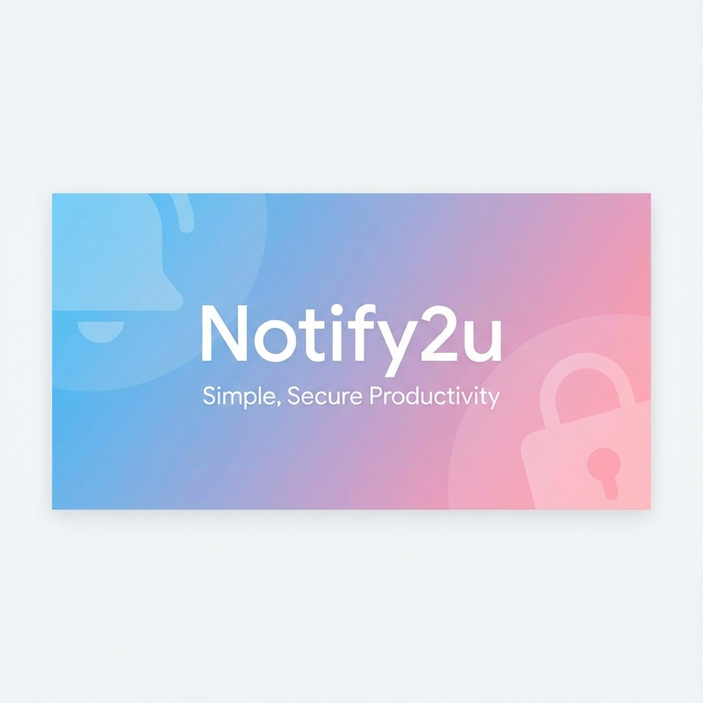
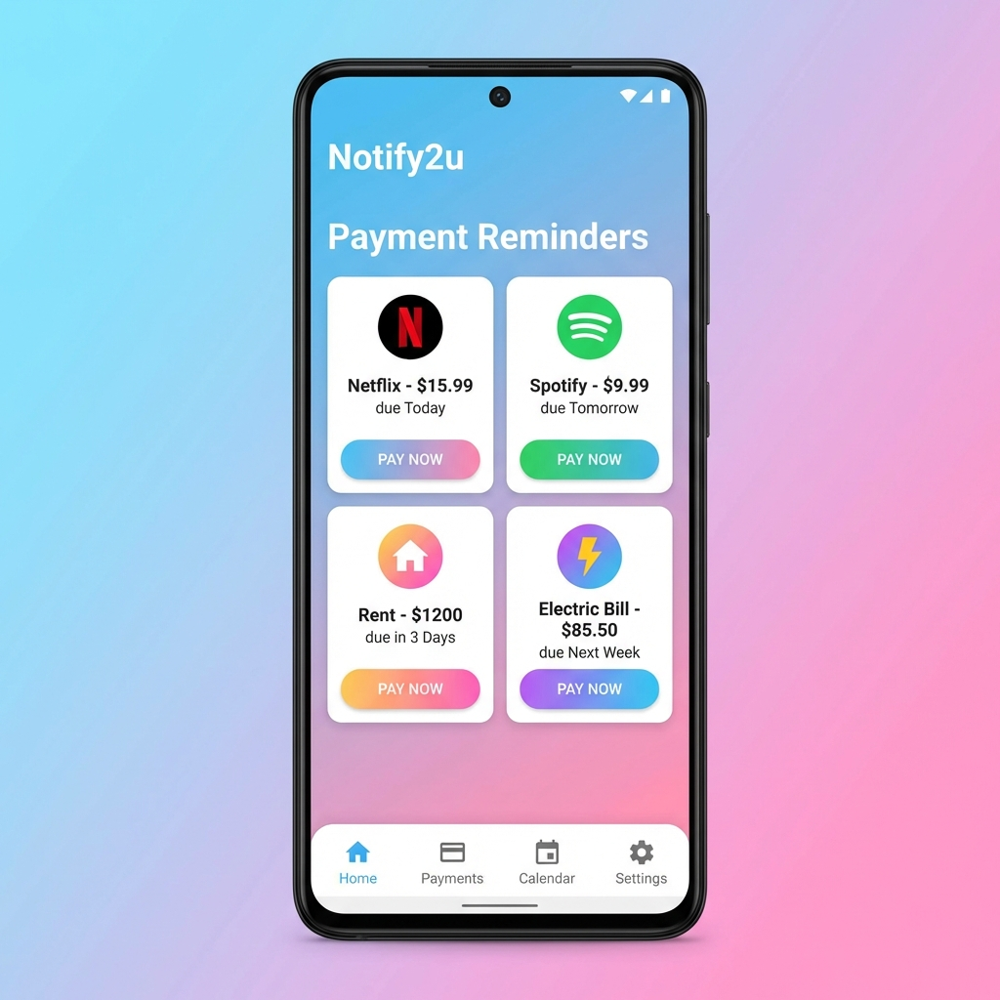
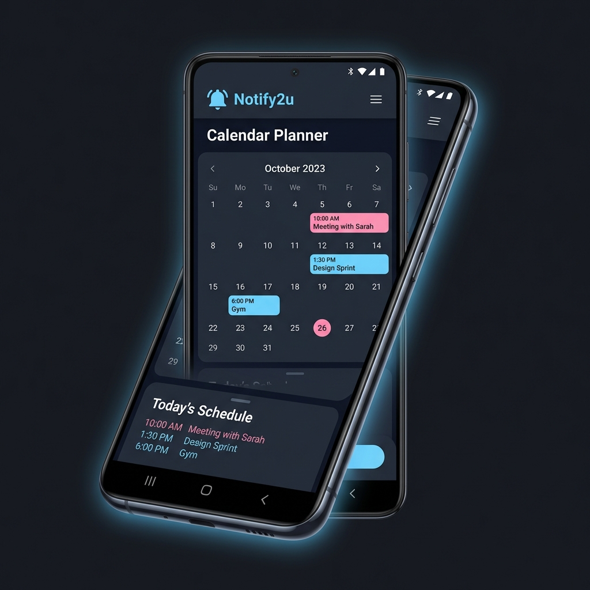
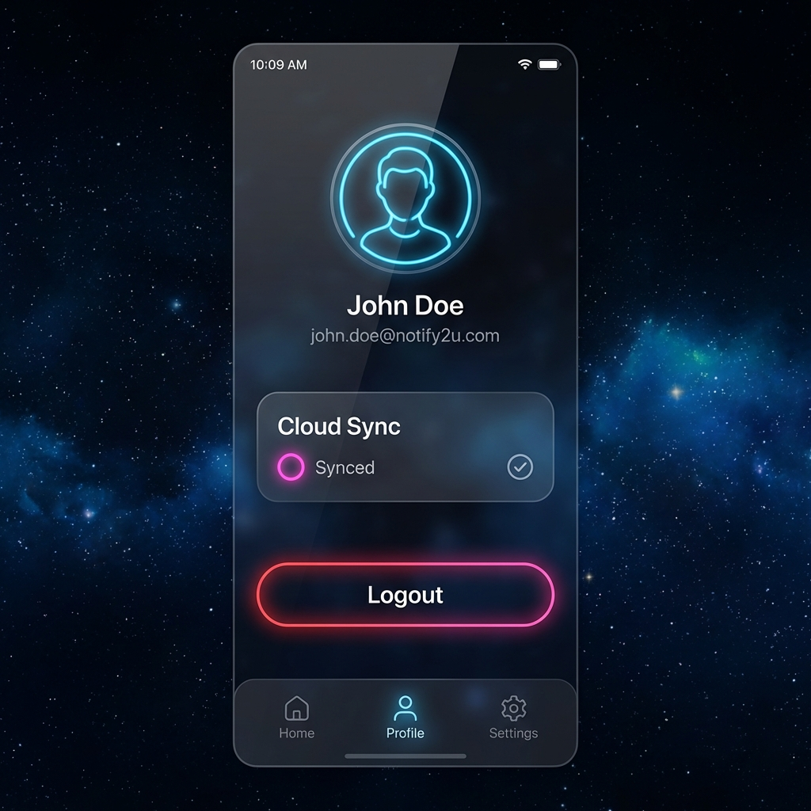

# Notify2u — Smart Task Reminder App

Notify2u is a modern Android application developed using Jetpack Compose, designed to help users manage, track, and receive reminders for tasks and payments—whether they are dues to be paid or collected. With a color-coded UI, recurring reminder support, and notification alerts, Notify2u simplifies personal task and finance tracking in an efficient and intuitive way.

---

## ✨ Key Features

### 🎨 Premium Neon UI Overhaul

- **High-Fidelity Aesthetic**: Vibrant fluorescent pink and blue gradient theme.
- **Glassmorphism**: Elegant semi-transparent surfaces with soft glows and clean borders.
- **Adaptive Theme**: Optimized for deep space dark mode for maximum visual impact.

### 🔄 Real-time Cloud Synchronization

- **Bidirectional Sync**: Seamlessly syncs data between local Room database and Cloud Firestore.
- **Offline Support**: Automatically pushes updates when the connection is restored.
- **Conflict Resolution**: Smart timestamp-based logic to prioritize the latest data.

### 🔐 Multi-Layer Authentication

- **Firebase Auth**: Secure backend authentication for cloud data isolation.
- **Biometric Security**: Fingerprint/Face ID integration for local app access.
- **Custom Auth Flow**: Premium redesigned Login and SignUp screens with neon aesthetics.

### 📅 Advanced Reminder Management

- **Recurring Tasks**: Supports Daily, Weekly, and Monthly intervals with auto-generation.
- **Color-Coded Status**: Neon pink and blue indicators for task priority and completion.
- **Detailed Analytics**: Track payment history and task completion rates.

### 🔔 Smart Notifications

- **Daily Alerts**: Scheduled reminders delivered via WorkManager.
- **Status Persistence**: Reminders are restored automatically after device reboot.

---

## 📸 Visual Identity

<p align="center">
  
</p>

<p align="center">
  
  
  
  
</p>
---

## Tech Stack

| Component        | Technology                              |
| ---------------- | --------------------------------------- |
| UI               | Jetpack Compose, Material3              |
| Architecture     | MVVM                                    |
| Navigation       | Jetpack Navigation Compose              |
| Database         | Room (SQLite ORM) & Cloud Firestore     |
| Auth             | Firebase Auth & Biometrics              |
| Background Tasks | WorkManager with CoroutineWorker        |
| Preferences      | SharedPreferences                       |
| Notifications    | NotificationCompat, NotificationChannel |
| Language         | Kotlin                                  |
| Min SDK          | 26 (Android 8.0)                        |

---

## Debugging and Testing

- Logs are filtered using the `Notify2uNotif` tag for easier debugging
- Logging includes:
  - WorkManager execution status
  - Time match checks
  - Reminder fetch counts
- Manual invocation of `scheduleDailyReminder()` is supported for testing
- App behavior has been validated for:
  - Background and killed states
  - Device restarts
  - Avoiding duplicate daily notifications

---

## Future Enhancements

- Google Calendar integration
- Reminder snooze functionality
- Export data as Excel or CSV

---

## 📥 How to Clone and Run

```bash
# Clone the repository
git clone https://github.com/rakzzm/Notify2u.git

# Open the project in Android Studio
# Add your google-services.json to the app/ directory
# Let Gradle sync and dependencies resolve

# Run the app on an emulator or Android device
```

---

## License

This project welcomes collaboration and feedback. Feel free to fork the repository or open issues and pull requests.
